## Brus-16 instruction set

### Format 0

#### Encoding

#### Instructions

ADD 

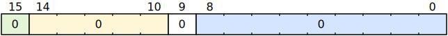

SUB 

MUL 

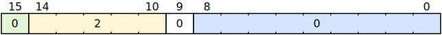

AND 

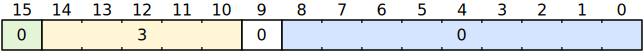

OR 

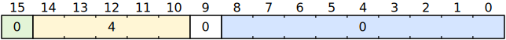

XOR 

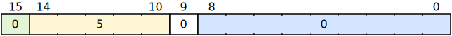

SHL 

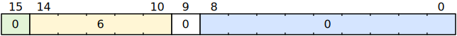

SHR 

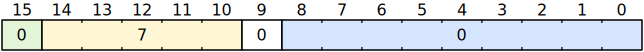

SHRA 

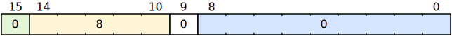

EQ 

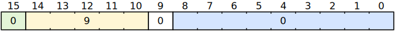

NEQ 

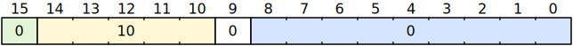

LT 

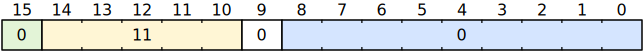

LE 

GT 

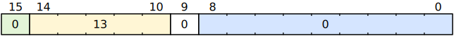

GE 

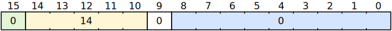

LTU 

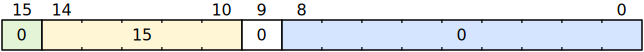

ADD simm

SUB simm

MUL simm

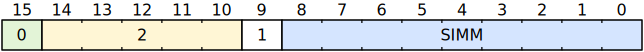

AND simm

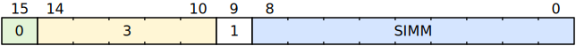

OR simm

XOR simm

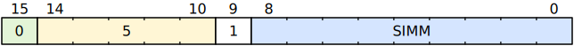

SHL simm

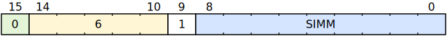

SHR simm

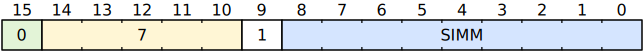

SHRA simm

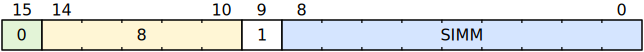

EQ simm

NEQ simm

LT simm

LE simm

GT simm

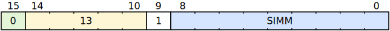

GE simm

LTU simm

LOAD simm

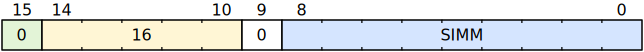

STORE simm

GET_LOCAL simm

SET_LOCAL simm

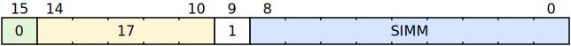

LOCALS simm

SET_FP 

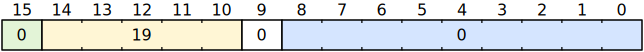

RET simm

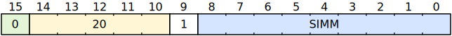

PUSH simm

PUSH_MR 

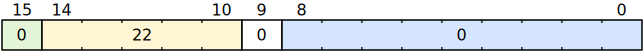

WAIT 

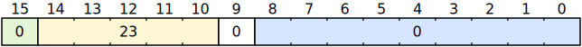

### Format 1

#### Encoding

#### Instructions

JMP imm

JZ imm

CALL imm

PUSHU imm

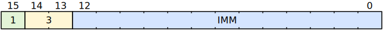